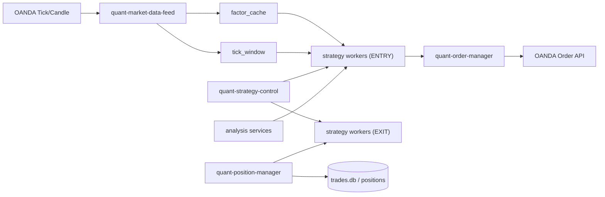

# AGENTS.md – QuantRabbit Agent Specification（整理版）

## 1. ミッション / 役割
> 狙い: USD/JPY で 資産の10%増を狙う 24/7 無裁量トレーディング・エージェント。  
> 凄腕のプロトレーダーのトレードを再現するシステム。  
> 境界: 発注・リスクは機械的、曖昧判断はローカルルール（LLMは任意のゲートのみ）。

- VM 上で常時ログ・オーダーを監視。
- トレード判断・ロット・利確/損切り・保有調整は固定値運用を避け、市場状態に応じて常時動的に更新する。
- 手動玉を含めたエクスポージャを高水準で維持。
- PF/勝率が悪化した戦略は、時間帯ブロックで抑えるのではなく、原因分析と改善を優先する（ただし JST 7〜8時のメンテ時間は運用対象外）。
- マージン拒否やタグ欠損を検知したら即パラメータ更新＆デプロイ。
- ユーザ手動トレードと併走し、ポジション総量を管理。
- 最優先ゴールは「資産を劇的に増やす」。必要なリスクテイクと調整を即断・即実行。

## 2. 非交渉ルール（必ず守る）
- ニュース連動パイプラインは撤去済み（`news_fetcher` / `summary_ingestor` / NewsSpike は無効）。
- LLM（Vertex）は **任意の Brainゲート** に限定して使用可。メインの判定は `analysis/local_decider.py` のローカル判定のみ。
- Brainゲート: `workers/common/brain.py` を `execution/order_manager.py` の preflight に適用し、**許可/縮小/拒否**を返す（default: disabled）。
- Brain 有効化は `BRAIN_ENABLED=1` と Vertex 認証（`VERTEX_PROJECT_ID` / `VERTEX_LOCATION` 等）が必須。
- 現行デフォルト: `WORKER_ONLY_MODE=true` / `MAIN_TRADING_ENABLED=0`。共通 `exit_manager` はスタブ化され、エントリー/EXIT は各戦略ワーカー＋専用 `exit_worker` が担当。
- **後付けの一律EXIT判定は作らない**。exit判断は各戦略ワーカー/専用 `exit_worker` のみが行う。`quant-strategy-control` は `entry/exit/global_lock` のガードのみで、全戦略に対する共通ロジックの事後的拒否/抑止を追加しない。
- 各戦略は `entry_thesis` に「`entry_probability`」と「`entry_units_intent`」を必須で渡して、`order_manager` はここを受けるのみとする。`session_open` を含む `AddonLiveBroker` 経路でも、order 送出時にこの2値を確実に注入する。確率閾値・サイズ設計は戦略ローカルで行い、共通レイヤは強制的に戦略を選別しない（ガード・リスク系の拒否のみ）。
- **黒板協調（意図調整）は `execution/strategy_entry.py` 経由で実装**する。  
  - `market_order` / `limit_order` は、`/order/coordinate_entry_intent` を呼び、`instrument`/`pocket`/`strategy_tag`/`side`/`raw_units`/`entry_probability` を共有 DB（`entry_intent_board`）で照合して、同時衝突時も戦略意図を原則維持する。  
  - `order_manager` は `order_manager` 側で黒板上書きをせず、ガード・リスク（margin/損失上限など）による最終拒否・縮小だけを行う。  
  - `entry_probability` が極端に低い場合は既存の確率ベース拒否に従う。逆方向意図の圧力が高くても、方向意図は原則保持し、最終ユニットは `strategy_entry` で反映した上でのみ送出する。  
  - `manual` や `strategy_tag` 解決不可、`min_units` 未満の結果は `order_manager` 経路に流さず、協調拒否として扱う。  
  - **判定要件（固定）**
    - 入力必須: `instrument`, `pocket`, `strategy_tag`, `side`, `raw_units`, `entry_probability`（省略時は `confidence` 補完可）。
    - `pocket == manual` または `raw_units == 0` は協調対象外（値はそのまま通過）。
    - `strategy_tag` 解決不可は即座に協調拒否。  
    - 2 秒ウィンドウ（`ORDER_INTENT_COORDINATION_WINDOW_SEC`, 既定 `2.0`）内の `entry_intent_board` を集計し、`entry_probability` と `units` の積で重み化した `score = abs(units) * probability` を算出。  
    - 自己の score = `own_score`、同方向合計 score = `same_score`、逆方向合計 score = `opposite_score`。  
      - 逆方向 score が 0 なら原則受理。  
      - `dominance = opposite_score / max(own_score, 1.0)` を算出して監視記録する。  
      - 方向意図は原則 `raw_units` のまま通し、`min_units` 未満の条件でのみ最終通過を 0 として協調拒否する。  
    - 記録は必須: `status` は `intent_accepted/intent_scaled/intent_rejected` とし、`reason` は `scale_to_zero/below_min_units_after_scale/coordination_load_error` 等を格納。  
- 発注経路はワーカーが直接 OANDA に送信するのが既定（`SIGNAL_GATE_ENABLED=0` / `ORDER_FORWARD_TO_SIGNAL_GATE=0`）。共通ゲートを使う場合のみ両フラグを 1 にする。
- 共通エントリー/テックゲート（`entry_guard` / `entry_tech`）は廃止・使用禁止。
- 型ゲート（Pattern Gate）は `workers/common/pattern_gate.py` を `execution/order_manager.py` preflight に適用する。**ただし全戦略一律強制はしない**（デフォルトは戦略ワーカーの opt-in）。
- 運用方針は「全て動的トレード」。静的な固定パラメータに依存せず、戦略ごとのローカル判定とリスク制御で都度更新する。
- **浅い検討で進めない**。変更前に必ず「目的 / 仮説 / 影響範囲 / 検証手順」を明確化し、実データ（VMログ・DB・API応答）で根拠を確認してから実装・報告する。
- **戦略は停止より改善を優先する**。成績悪化時は原因分析→パラメータ/執行品質の改善→再検証を先に実行し、恒久的な時間帯制限で回避しない。**JST 7〜8時（メンテ時間帯想定）は除外**し、停止は安全確保のための一時的な緊急措置に限定する。
- **重要**: 本番稼働は VM。運用上の指摘・報告・判断は必ず VM（ログ/DB/プロセス）または OANDA API を確認して行い、ローカルの `logs/*.db` やスナップショット/コード差分だけで断定しない。
- 変更は必ず `git commit` → `git push` → VM 反映（`scripts/vm.sh ... deploy -i -t` 推奨）で行う。未コミット状態やローカル差し替えでの運用は不可。
- 変更点は必ず AGENTS と実装仕様側へ同時記録すること。少なくとも `docs/WORKER_REFACTOR_LOG.md` と関連仕様（`docs/WORKER_ROLE_MATRIX_V2.md`/`docs/ARCHITECTURE.md` 等）へ追記し、追跡可能な監査ログを残す。
- 改善/敗因の運用記録は **`docs/TRADE_FINDINGS.md` の1箇所に集約** する。新しい分析を行ったら必ず同ファイルへ追記し、同種の分散メモを新規作成しない。
- 並行作業により「エージェントが触っていない未コミット差分」が作業ツリーに残っていることがある。
- その差分は「他者/他タスクの作業中変更」を前提に、関連ファイルを読んで意図を把握したうえで今回タスクを継続する（差分の存在だけで作業停止・続行確認を挟まない）。
- **並行タスク時のGit運用を厳守**: 作業開始前/コミット前に `git status --short` と `git diff --name-only` を確認し、ステージは自分が変更したファイルのみに限定する。タスク単位でコミットを分離し、他タスク差分を混在・巻き戻ししない。
- commit/push→VM反映は **自分が変更したファイルだけ** をステージして行う（他の差分は混ぜない・勝手に戻さない）。
- **コミット/反映は自律完遂を必須化**: 変更ごとにコミットメッセージを自分で判断して `git commit`・`git push`・VMデプロイ・VM上の反映確認（`HEAD == origin/main` と `Application started!`）まで連続実行する。反映確認が終わるまで「完了報告」しない。
- **本番ブランチ運用**: 本番 VM は原則 `main` のみを稼働ブランチにする。`codex/*` など作業ブランチを本番常駐させない。
- **本番反映の固定手順**: `main` へ統合（merge/rebase）→ `git push origin main` → `scripts/vm.sh ... deploy -b main -i --restart <target-unit> -t` を必須化する。`<target-unit>` は起動中の systemd ユニット（最低でもデータ/制御を含む `quant-market-data-feed.service` 等）を明示する（`pull` のみ禁止）。
- **反映確認の必須チェック**: デプロイ後に VM で `git rev-parse HEAD` と `git rev-parse origin/main` の一致を確認し、対象ユニットの `journalctl -u <target-unit>` で直近 `Application started!` がデプロイ後であることを確認する。`git pull` 後に再起動が無い場合は「未反映」と見なす。
- IAP（OS Login）SSH 認証が繰り返し失敗する場合は、まず `scripts/recover_iap_ssh_auth.sh` を実行する。ここで収束しない場合は `scripts/deploy_to_vm.sh` 実行前に `scripts/deploy_via_metadata.sh` フォールバックへ移行する。
- ログ退避の本番導線は `quant-core-backup.timer`（`/usr/local/bin/qr-gcs-backup-core`）を正とし、`/etc/cron.hourly/qr-gcs-backup-core` は恒久的に無効化する。バックアップは low-priority + 負荷ガード（load/D-state/mem/swap）で、トレード導線を阻害しないことを優先する。
- VM 削除禁止。再起動やブランチ切替で代替し、`gcloud compute instances delete` 等には触れない。

## 3. 時限情報（必ず最新を参照）
- 2025-12 の攻め設定、mask 済み unit などは `docs/OPS_CURRENT.md` を参照。
- 2026-02-19 追記: `scalp_macd_rsi_div_b_live` は精度改善のため
  `range-only` + divergence 閾値強化のプロファイルへ更新。
  運用値は `ops/env/quant-scalp-macd-rsi-div-b.env`、監査ログは
  `docs/WORKER_REFACTOR_LOG.md` と `docs/RISK_AND_EXECUTION.md` を正とする。

## 4. 仕様ドキュメント索引
- `docs/INDEX.md`: ドキュメントの起点。
- `docs/ARCHITECTURE.md`: システム全体フロー、データスキーマ。
- `docs/RISK_AND_EXECUTION.md`: エントリー/EXIT/リスク制御、OANDA マッピング。
- `docs/OBSERVABILITY.md`: データ鮮度、ログ、SLO/アラート、検証パイプライン。
- `docs/RANGE_MODE.md`: レンジモード強化とオンラインチューニング運用。
- `docs/OPS_GCP_RUNBOOK.md`: GCP/VM 運用ランブック。
- `docs/OPS_SKILLS.md`: 日次運用スキル運用。
- `docs/KATA_SCALP_PING_5S.md`: 5秒スキャB（`scalp_ping_5s_b`）の型（Kata）設計・運用。
- `docs/KATA_SCALP_M1SCALPER.md`: M1スキャ（`scalp_m1scalper`）の型（Kata）設計・運用。
- `docs/KATA_MICRO_RANGEBREAK.md`: micro（`MicroRangeBreak`）の型（Kata）設計・運用。
- `docs/KATA_PROGRESS.md`: 型（Kata）の進捗ログ（VMスナップショット/展開計画）。
- `docs/WORKER_REFACTOR_LOG.md`: ワーカー再編（データ供給・制御・ENTRY/EXIT分離）の確定記録。
- `docs/TRADE_FINDINGS.md`: 改善/敗因の単一台帳（全担当者共通）。

## 5. ワーカー再編（V2）—役割を完全分離

### 方針（固定）
- 詳細は `docs/WORKER_ROLE_MATRIX_V2.md`（最上位フロー図・運用制約）を正規版として参照。

- **データ面**: OANDA から tick/足を受けるのは `quant-market-data-feed` のみ。`tick_window` と `factor_cache` を更新することを唯一の責務とする。
- **制御面**: `quant-strategy-control` のみが `entry/exit/global_lock` を持つ。  
  各戦略ワーカーは自分の `ENTRY/EXIT` の判定にこれを参照する。
- **戦略面**: 各戦略は必ず `ENTRY ワーカー` と `EXIT ワーカー` を `1:1` で運用。  
  `strategy module が複数戦略を内部に持つ` 形は不可。
- 各戦略のENTRY判断は strategy ロジック側で完結。`entry_probability` / `entry_units_intent` を `entry_thesis` へ付与し、`order_manager` はその意図を参照して制約内で実行する。
- **オーダー面**: `execution/order_manager.py` の処理は **新規ワーカー分離対象**。  
  `quant-order-manager` へ移設済み。戦略群は本ワーカーを介してのみ注文実行を実施する。
  - 戦略の意図協調（黒板）は `execution/strategy_entry.py` の同一意図判定呼び出しにより、最終ロットは pre-order で決定してから `order_manager` へ渡す。
- **ポジ面**: `execution/position_manager.py` も **新規ワーカー分離対象**。  
  `quant-position-manager` へ移設済み。戦略群は本ワーカーを介してのみ保有状態を参照する。
- **分析・監視面**: `quant-pattern-book`, `quant-range-metrics`, `quant-dynamic-alloc`,
  `quant-ops-policy` 等は「データ分析/状態分析」ロールに固定し、戦略実行ロジックへ混在させない。

### V2 で保有すべき固定サービス群（実行時）
- `quant-market-data-feed`
- `quant-strategy-control`
- `quant-order-manager`
- `quant-position-manager`
- 戦略 ENTRY/EXIT 一対一サービス（scalp / micro / s5）
- 補助: `quant-pattern-book`, `quant-range-metrics`, `quant-ops-policy`, `quant-dynamic-alloc`, `quant-policy-guard`

### V2 移行目標（debt）
- `quantrabbit.service`（monolithicエントリ）を廃止。`main.py` は開発・分析用途としてのみ扱い、本番起動用 unit から外す。
- オーダー処理とポジ管理は `V2` で「別サービス化」済み。



## 6. チーム / タスク運用ルール（要点）
- 1 ファイル = 1 PR、Squash Merge、CI green。
- 秘匿情報は Git に置かない。
- タスク台帳は `docs/TASKS.md` を正本とし、Open→進行→Archive の流れで更新。
- オンラインチューニング ToDo は `docs/autotune_taskboard.md` に集約。
- **マルチエージェント実行は義務とする**: すべての新規タスクは、基本的に少なくとも2系統で起動する。  
  - 分析エージェント（`agent_type=explorer`）が仕様・影響範囲・既存実装を確認。  
  - 実装エージェント（`agent_type=worker`）が変更を実施。  
  - テスト・監査・運用観点が必要な場合は追加の確認エージェントを必ず割当。  
- 例外を除いて、同一エージェント内で分析→実装を連続で完結させることを禁止する。  
  - 例外: 1ファイル 10行未満の修正で、事前分析が不要で、影響範囲が明確な緊急停止系の暫定対応。  
- **他タスクへ持ち越しルール**: これまでマルチエージェントを経ずに実施された作業は、次回タスク開始時に必ず当該タスクとして再棚卸しし、同一方針（分析＋実装）で追跡可能な形に戻す。  
- 分析は `spawn_agent`（`agent_type=explorer`）で要件・影響範囲・既存実装を確認。  
- 実装は `spawn_agent`（`agent_type=worker`）で担当。  
- 検証・監査は必要に応じて追加エージェントへ分担し、最終判断は実データ（VM/ログ/DB）確認で行う。  
- 小規模な1ファイル修正などの軽微タスクでも、可能なら2系統（実施/確認）で並走し、変更意図と差分内容を相互に突合する。

## 7. 型（Pattern Book）運用ルール
- 目的: トレード履歴から「勝てる型 / 避ける型」を継続学習し、エントリー時の `block/reduce/boost` 判断に使う。
- 収集ジョブ: `scripts/pattern_book_worker.py`。systemd は `quant-pattern-book.service` + `quant-pattern-book.timer`（5分周期）。
- 実行Python: `quant-pattern-book.service` は必ず `/home/tossaki/QuantRabbit/.venv/bin/python` を使う（system python禁止）。
- 主な出力:
  - DB: `/home/tossaki/QuantRabbit/logs/patterns.db`
  - JSON: `/home/tossaki/QuantRabbit/config/pattern_book.json`
  - deep JSON: `/home/tossaki/QuantRabbit/config/pattern_book_deep.json`
- 主なテーブル:
  - `pattern_trade_features`（トレード特徴）
  - `pattern_stats` / `pattern_actions`（基本集計とアクション）
  - `pattern_scores` / `pattern_drift` / `pattern_clusters`（深掘り分析）
- 深掘り分析（`analysis/pattern_deep.py`）は `numpy/pandas/scipy/sklearn` を使い、統計検定・ドリフト・クラスタリングを更新する。
- エントリー連携:
  - `execution/order_manager.py` preflight で `workers/common/pattern_gate.py` を評価。
  - `quality=avoid` かつ十分サンプルで `pattern_block`。
  - `suggested_multiplier` と `drift` でロットを縮小/拡大（下限未満は `pattern_scale_below_min`）。
- 重要: デフォルトは戦略opt-in。`ORDER_PATTERN_GATE_GLOBAL_OPT_IN=0` を維持し、各戦略ワーカーの `entry_thesis` に `pattern_gate_opt_in=true` を明示したものだけ適用する。
- opt-in 戦略（main 実装済み）:
- `scalp_ping_5s_b`: `SCALP_PING_5S_B_PATTERN_GATE_OPT_IN=1`
- `scalp_m1scalper`: `SCALP_M1SCALPER_PATTERN_GATE_OPT_IN=1`
- `TickImbalance`（`workers/scalp_precision`）: `TICK_IMB_PATTERN_GATE_OPT_IN=1`（+必要なら `TICK_IMB_PATTERN_GATE_ALLOW_GENERIC=1`）
- `MicroRangeBreak`（`workers/micro_multistrat`）: `MICRO_RANGEBREAK_PATTERN_GATE_OPT_IN=1`（+必要なら `MICRO_RANGEBREAK_PATTERN_GATE_ALLOW_GENERIC=1`）
- 運用判断は必ずVM実データで行う。`patterns.db` / `pattern_book*.json` の時刻・件数・quality分布を確認してから閾値調整する。

## 8. V2導線フリーズ運用（env/systemd監査）

- 方針: 発注導線・EXIT導線は V2 分離構成を変えず固定し、後付けの一律判断を導入しない。
- 不変条件
  - エントリーは strategy worker → `execution.order_manager` → 共通 preflight のみ。
  - `order_manager` が戦略の選別ロジックを上書きしない。許可/縮小/拒否は preflight ガード・risk 側条件のみに限定。
  - close/exit 判断は各 strategy の exit_worker と該当ワーカー側ルールを主とし、`quant-order-manager`/`quant-position-manager` は通路と参照窓口として扱う。
  - `entry_probability` と `entry_units_intent` を `entry_thesis` で必須維持。
  - `quantrabbit.service` を本番主導線にしない。
  - `quant-replay-quality-gate` は `REPLAY_QUALITY_GATE_AUTO_IMPROVE_ENABLED=1` のとき、
    replay run 出力を `analysis.trade_counterfactual_worker` へ連結する。
    `policy_hints.block_jst_hours` は `config/worker_reentry.yaml` へ自動反映しない（時間帯封鎖ではなく改善提案として扱う）。
    JST 7〜8時はメンテ時間として除外し、それ以外の時間帯に対する恒久的な時間帯除外を禁止する。
    ただし `REPLAY_QUALITY_GATE_AUTO_IMPROVE_MAX_BLOCK_HOURS` を超える候補は採用しない。
    `REPLAY_QUALITY_GATE_AUTO_IMPROVE_MIN_APPLY_INTERVAL_SEC` の間隔内は
    解析のみ行い、`worker_reentry` 反映は抑制する。
    監査は `logs/replay_quality_gate_latest.json` の `auto_improve` を正本とする。
- 実VM監査（実行）
  - running 状態（V2固定群）
  ```bash
  gcloud compute ssh fx-trader-vm --project=quantrabbit --zone=asia-northeast1-a --tunnel-through-iap --command "systemctl list-units --type=service --state=running --no-pager | grep -E 'quant-(market-data-feed|strategy-control|order-manager|position-manager|scalp|micro|pattern|range|dynamic|policy)'"
  ```
  - unit enable 状態（主要群）
  ```bash
  gcloud compute ssh fx-trader-vm --project=quantrabbit --zone=asia-northeast1-a --tunnel-through-iap --command "systemctl list-unit-files --type=service | grep -E 'quant-market-data-feed|quant-order-manager|quant-position-manager|quant-strategy-control|quant-scalp-.*|quant-micro-.*'"
  ```
  - runtime env `ops/env/quant-v2-runtime.env` の監査キー
  ```bash
  gcloud compute ssh fx-trader-vm --project=quantrabbit --zone=asia-northeast1-a --tunnel-through-iap --command "for k in WORKER_ONLY_MODE MAIN_TRADING_ENABLED SIGNAL_GATE_ENABLED ORDER_FORWARD_TO_SIGNAL_GATE EXIT_MANAGER_DISABLED ORDER_MANAGER_SERVICE_ENABLED ORDER_MANAGER_SERVICE_FALLBACK_LOCAL POSITION_MANAGER_SERVICE_ENABLED POSITION_MANAGER_SERVICE_FALLBACK_LOCAL ORDER_PATTERN_GATE_ENABLED ORDER_PATTERN_GATE_GLOBAL_OPT_IN BRAIN_ENABLED ORDER_MANAGER_BRAIN_GATE_ENABLED ORDER_MANAGER_FORECAST_GATE_ENABLED POLICY_HEURISTIC_PERF_BLOCK_ENABLED ENTRY_GUARD_ENABLED ENTRY_TECH_ENABLED; do v=$(grep -E \"^${k}=\\\"?\" /home/tossaki/QuantRabbit/ops/env/quant-v2-runtime.env | head -n 1); echo \"${k}=${v:-<MISSING>}\"; done"
  ```
  - 主要 unit の env/起動引数（照合）
  ```bash
  gcloud compute ssh fx-trader-vm --project=quantrabbit --zone=asia-northeast1-a --tunnel-through-iap --command "for u in quant-order-manager.service quant-position-manager.service quant-strategy-control.service quant-market-data-feed.service quant-scalp-ping-5s-b.service quant-scalp-ping-5s-b-exit.service quant-micro-multi.service quant-micro-multi-exit.service quant-scalp-macd-rsi-div.service quant-scalp-macd-rsi-div-exit.service; do if systemctl cat \"$u\" >/dev/null 2>&1; then echo \"---$u---\"; systemctl cat \"$u\" | sed -n '1,130p'; fi; done"
  ```
  - `main` 側自動監査（service化）:
  ```bash
  sudo bash scripts/install_trading_services.sh --repo /home/tossaki/QuantRabbit --units quant-v2-audit.service quant-v2-audit.timer
  sudo systemctl enable --now quant-v2-audit.timer
  ```
  - 監査報告:
  - `logs/ops_v2_audit_latest.json`
  - `journalctl -u quant-v2-audit.service -n 200 --no-pager`
  - 戦略workerの運用ルール（監査用）
  - `systemctl cat` で `EnvironmentFile=-/home/tossaki/QuantRabbit/ops/env/quant-v2-runtime.env` と
    `EnvironmentFile=-/home/tossaki/QuantRabbit/ops/env/quant-<worker>.env` の両方が存在することを確認する。
    - 例: `quant-scalp-ping-5s-b*.service` は上記2つ＋戦略オーバーライドenv (`scalp_ping_5s_b.env`) を持つ。
    - `quant-order-manager.service` / `quant-position-manager.service` は
      `ops/env/quant-order-manager.env` / `ops/env/quant-position-manager.env` を持つことを確認する。
- 判定のゴール
  - 上位導線群が active/running し、`quantrabbit.service` が主導線になっていない。
  - 上記監査キーがフリーズ方針に一致し、service 側の `EnvironmentFile` が一本化されている。
