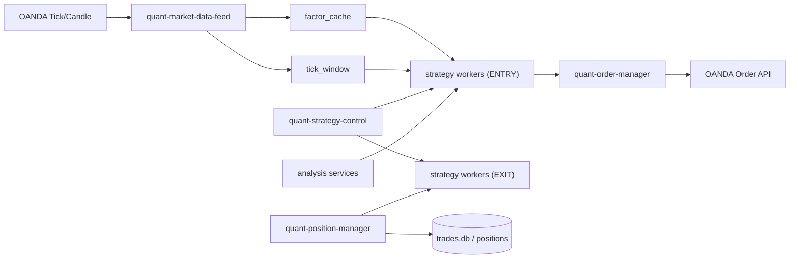

# AGENTS.md – QuantRabbit Agent Specification（整理版）

## 追記（最上位制約）
- 2026-03-04以降の現行運用として、実運用はローカルV2導線のみとする。
- VM/GCP/Cloud Run は現行運用に存在しない前提とし、関連コマンドは実行しない。
- この追記はAGENTSの既存項目より優先し、以後の実務方針を上書きする。
- 現在の前提: GCP上の運用資産（`fx-trader-vm` 系を含む）は存在しない。

## 1. ミッション / 役割
> 狙い: USD/JPY で 資産の10%増を狙う 24/7 無裁量トレーディング・エージェント。  
> 凄腕のプロトレーダーのトレードを再現するシステム。  
> 境界: 発注・リスクは機械的、曖昧判断はローカルルール（LLMは任意のゲートのみ）。

- 現行運用（2026-03-04 以降）はローカル専用。VM/GCP/Cloud Run は運用対象外とする。
- トレード判断・ロット・利確/損切り・保有調整は固定値運用を避け、市場状態に応じて常時動的に更新する。
- 手動玉を含めたエクスポージャを高水準で維持。
- PF/勝率が悪化した戦略は、時間帯ブロックで抑えるのではなく、原因分析と改善を優先する（ただし JST 7〜8時のメンテ時間は運用対象外）。
- マージン拒否やタグ欠損を検知したら即パラメータ更新＆デプロイ。
- ユーザ手動トレードと併走し、ポジション総量を管理。
- 最優先ゴールは「資産を劇的に増やす」。必要なリスクテイクと調整を即断・即実行。
- 次のタスクが出た場合は、原則として事前の追加確認を待たず、実行方針が明確な限り完了まで進める。

## 2. 非交渉ルール（必ず守る）
- ニュース連動パイプラインは撤去済み（`news_fetcher` / `summary_ingestor` / NewsSpike は無効）。
- **現行の最優先運用モード（2026-03-04 以降）**: 実装・検証・PDCA はローカル導線を正とし、VM/GCP 前提の手順は実行しない。
- 作業前にはUSD/JPYの市況確認を必須化する。
  - 確認対象: 現在価格帯、スプレッド、直近ATR/レンジ推移、約定・拒否の直近実績、OANDA APIの応答品質。
  - 確認手段: ローカル `logs/*.db` + OANDA API、該当戦略 worker/position_manager 的ログ、必要に応じて直近チャート。
  - 判定: 市況が通常レンジ外・流動性悪化時は、作業は保留し `docs/TRADE_FINDINGS.md` と運用ログへその理由を残す。
- 各タスク開始時は、着手前チェックとして `docs/AGENT_COLLAB_HUB.md` の「運用手順」を必ず読む。最低限 `sed -n '/^## 運用手順/,/^## /p' docs/AGENT_COLLAB_HUB.md` を実行し、現行手順を確認してから作業に入る。
- LLM/Brain は **任意の Brainゲート** に限定して使用可。メインの判定は `analysis/local_decider.py` のローカル判定のみ。
- Brainゲート: `workers/common/brain.py` を `execution/order_manager.py` の preflight に適用し、**許可/縮小/拒否**を返す。現行 local-v2 既定は `ops/env/local-v2-stack.env` の `LOCAL_V2_EXTRA_ENV_FILES` で `ops/env/profiles/brain-ollama-safe.env` を合成する safe canary（micro-only / apply / fail-open）を正とする。Brain context は `entry_thesis` / `meta` 欠損時でもローカル tick / M1 factor を補完し、cache は `strategy+pocket` 固定ではなく side / setup fingerprint 単位で扱う。shared Ollama runtime では background autotune が live preflight 実行中/直後を自動で退避する。entry 数を落とさないため、`entry_probability>=0.80` かつ `confidence>=75` の strong setup は、spread/ATR が通常帯なら common Brain の `BLOCK` を `REDUCE` へ矯正し、さらに shallow `REDUCE` (`reduce_to_allow_scale` 以上) で hard risk reason が無いものは `ALLOW` へ戻して participation を維持する。同一 strategy/pocket で Ollama timeout が連発した場合は `BRAIN_FAILFAST_*` で短い fail-open cooldown へ切り替え、4 秒 stall の連打で cadence を落とさない。
- Brain の aggressive/all-pocket 化は明示 opt-in とし、現行 safe canary は `BRAIN_ENABLED=1` と Ollama backend を前提にする。Vertex 認証は現行ローカル導線の必須条件ではない。
- 現行デフォルト: `WORKER_ONLY_MODE=true` / `MAIN_TRADING_ENABLED=0`。共通 `exit_manager` はスタブ化され、エントリー/EXIT は各戦略ワーカー＋専用 `exit_worker` が担当。
- **後付けの一律EXIT判定は作らない**。exit判断は各戦略ワーカー/専用 `exit_worker` のみが行う。`quant-strategy-control` は `entry/exit/global_lock` のガードのみで、全戦略に対する共通ロジックの事後的拒否/抑止を追加しない。
- 各戦略は `entry_thesis` に「`entry_probability`」と「`entry_units_intent`」を必須で渡して、`order_manager` はここを受けるのみとする。`session_open` を含む `AddonLiveBroker` 経路でも、order 送出時にこの2値を確実に注入する。確率閾値・サイズ設計は戦略ローカルで行い、共通レイヤは強制的に戦略を選別しない（ガード・リスク系の拒否のみ）。
- **黒板協調（意図調整）は `execution/strategy_entry.py` 経由で実装**する。  
  - `market_order` / `limit_order` は、`/order/coordinate_entry_intent` を呼び、`instrument`/`pocket`/`strategy_tag`/`side`/`raw_units`/`entry_probability` を共有 DB（`entry_intent_board`）で照合して、同時衝突時も戦略意図を原則維持する。  
  - `order_manager` は `order_manager` 側で黒板上書きをせず、ガード・リスク（margin/損失上限など）による最終拒否・縮小だけを行う。  
  - `entry_probability` が極端に低い場合は既存の確率ベース拒否に従う。逆方向意図の圧力が高くても、方向意図は原則保持し、最終ユニットは `strategy_entry` で反映した上でのみ送出する。  
  - `manual` や `strategy_tag` 解決不可、`min_units` 未満の結果は `order_manager` 経路に流さず、協調拒否として扱う。  
  - **判定要件（固定）**
    - 入力必須: `instrument`, `pocket`, `strategy_tag`, `side`, `raw_units`, `entry_probability`（省略時は `confidence` 補完可）。
    - `pocket == manual` または `raw_units == 0` は協調対象外（値はそのまま通過）。
    - `strategy_tag` 解決不可は即座に協調拒否。  
    - 2 秒ウィンドウ（`ORDER_INTENT_COORDINATION_WINDOW_SEC`, 既定 `2.0`）内の `entry_intent_board` を集計し、`entry_probability` と `units` の積で重み化した `score = abs(units) * probability` を算出。  
    - 自己の score = `own_score`、同方向合計 score = `same_score`、逆方向合計 score = `opposite_score`。  
      - 逆方向 score が 0 なら原則受理。  
      - `dominance = opposite_score / max(own_score, 1.0)` を算出して監視記録する。  
      - 方向意図は原則 `raw_units` のまま通し、`min_units` 未満の条件でのみ最終通過を 0 として協調拒否する。  
    - 記録は必須: `status` は `intent_accepted/intent_scaled/intent_rejected` とし、`reason` は `scale_to_zero/below_min_units_after_scale/coordination_load_error` 等を格納。  
- 発注経路はワーカーが直接 OANDA に送信するのが既定（`SIGNAL_GATE_ENABLED=0` / `ORDER_FORWARD_TO_SIGNAL_GATE=0`）。共通ゲートを使う場合のみ両フラグを 1 にする。
- 共通エントリー/テックゲート（`entry_guard` / `entry_tech`）は廃止・使用禁止。
- 型ゲート（Pattern Gate）は `workers/common/pattern_gate.py` を `execution/order_manager.py` preflight に適用する。**ただし全戦略一律強制はしない**（デフォルトは戦略ワーカーの opt-in）。
- 運用方針は「全て動的トレード」。静的な固定パラメータに依存せず、戦略ごとのローカル判定とリスク制御で都度更新する。
- **浅い検討で進めない**。変更前に必ず「目的 / 仮説 / 影響範囲 / 検証手順」を明確化し、実データ（ローカルログ/DB・API応答）で根拠を確認してから実装・報告する。
- **収益悪化の分析は side 名義で閉じない**。`long/short` だけで説明せず、`pattern_tag / RSI / ADX / MA gap / trend_snapshot / divergence / 連続バー偏り` など指標状態で敗因をクラスタ化し、両方向に対称な strategy-local quality guard として改善する。
- **戦略は停止より改善を優先する**。成績悪化時は原因分析→パラメータ/執行品質の改善→再検証を先に実行し、恒久的な時間帯制限で回避しない。**JST 7〜8時（メンテ時間帯想定）は除外**し、停止は安全確保のための一時的な緊急措置に限定する。
- **重要**: 運用上の指摘・報告・判断はローカルV2導線（`logs/*.db` + OANDA API）の実測のみで行う。
- 変更は `git commit` → `git push` → ローカル反映（`scripts/local_v2_stack.sh` ベース）で行う。未コミット状態やローカル差し替えでの運用は避ける。
- 変更点は必ず AGENTS と実装仕様側へ同時記録すること。少なくとも `docs/WORKER_REFACTOR_LOG.md` と関連仕様（`docs/WORKER_ROLE_MATRIX_V2.md`/`docs/ARCHITECTURE.md` 等）へ追記し、追跡可能な監査ログを残す。
- 改善/敗因の運用記録は **`docs/TRADE_FINDINGS.md` の1箇所に集約** する。新しい分析を行ったら必ず同ファイルへ追記し、同種の分散メモを新規作成しない。
- `docs/TRADE_FINDINGS.md` は単なる台帳ではなく、変更の良し悪しを後から改善に使うための change diary として扱う。各変更で最低限 `Why/Hypothesis`、`Expected Good`、`Expected Bad`、`Observed/Fact`、`Verdict`（`good/bad/pending`）、`Next Action` を残す。
- `scripts/trade_findings_diary_draft.py` と `logs/trade_findings_draft_latest.{json,md}` / `logs/trade_findings_draft_history.jsonl` は review-only の自動下書きとして扱う。`docs/TRADE_FINDINGS.md` への自動追記は禁止し、正式反映は必ずレビュー後に行う。whiteboard 通知は opt-in とし、同一 draft fingerprint では重複投稿しない。
- 並行作業により「エージェントが触っていない未コミット差分」が作業ツリーに残っていることがある。
- その差分は「他者/他タスクの作業中変更」を前提に、関連ファイルを読んで意図を把握したうえで今回タスクを継続する（差分の存在だけで作業停止・続行確認を挟まない）。
- **並行タスク時のGit運用を厳守**: 作業開始前/コミット前に `git status --short` と `git diff --name-only` を確認し、ステージは自分が変更したファイルのみに限定する。タスク単位でコミットを分離し、他タスク差分を混在・巻き戻ししない。
- commit/push→ローカル反映は **自分が変更したファイルだけ** をステージして行う（他の差分は混ぜない・勝手に戻さない）。
- **コミット/反映は自律完遂を必須化**: 変更ごとにコミットメッセージを自分で判断して `git commit`・`git push`・`scripts/local_v2_stack.sh up|restart ...` による反映確認（`status` と主要サービスログの最終更新）まで連続実行する。反映確認が終わるまで「完了報告」しない。
- **本番ブランチ運用**: 本番ラインは `main` のみで統一し、`codex/*` など作業ブランチを本番常駐させない。
- **本番反映の固定手順**: `main` へ統合（merge/rebase）→ `git push origin main` → `scripts/local_v2_stack.sh up|restart --env ops/env/local-v2-stack.env --services quant-market-data-feed,quant-strategy-control,quant-order-manager,quant-position-manager` を必須化する。`pull` のみでの反映は不可。
- **反映確認の必須チェック**: デプロイ後、`scripts/local_v2_stack.sh status --env ops/env/local-v2-stack.env --services quant-market-data-feed,quant-strategy-control,quant-order-manager,quant-position-manager` で起動状態を確認し、`logs/local_v2_stack/*.log` と主要戦略ログの時刻が最新であることを確認する。
- ログ退避の本番導線は `quant-core-backup.timer`（`/usr/local/bin/qr-gcs-backup-core`）を正とし、`/etc/cron.hourly/qr-gcs-backup-core` は恒久的に無効化する。バックアップは low-priority + 負荷ガード（load/D-state/mem/swap）で、トレード導線を阻害しないことを優先する。
- `scripts/vm.sh` / `scripts/deploy_to_vm.sh` / `scripts/deploy_via_metadata.sh` / `gcloud compute *` は実行禁止とする。

## 3. 時限情報（必ず最新を参照）
- 2025-12 の攻め設定、mask 済み unit などは `docs/OPS_CURRENT.md` を参照。
- 2026-03-09 追記: local-v2 の Brain は `LOCAL_V2_EXTRA_ENV_FILES=ops/env/profiles/brain-ollama-safe.env` を既定とし、manual restart / watchdog / launchd 復旧でも safe canary（micro-only / apply / fail-open）を維持する。`entry_thesis/meta` に spread/ATR が無い場合もローカル tick / factor_cache を補完し、async prompt/runtime autotune は preflight と分離した timeout で回す。shared Ollama runtime では `BRAIN_AUTOTUNE_LIVE_PRIORITY_COOLDOWN_SEC` を使って live preflight 優先を維持する。さらに local-v2 の common Brain は、strong setup (`entry_probability>=0.80`, `confidence>=75`) かつ通常 spread/ATR 帯では `BLOCK` より `REDUCE` を優先し、`reduce_to_allow_scale` 以上の shallow `REDUCE` は hard risk reason が無い限り `ALLOW` へ戻す。`BRAIN_FAILFAST_CONSECUTIVE_FAILURES=2` / `BRAIN_FAILFAST_COOLDOWN_SEC=30` / `BRAIN_FAILFAST_WINDOW_SEC=60` で timeout 連発時は短い fail-open cooldown へ切り替え、entry 頻度を落とさず quality だけを締めることを正とする。監査根拠は `docs/TRADE_FINDINGS.md` / `docs/RISK_AND_EXECUTION.md` を正とする。
- 2026-03-09 追記: `RangeFader` の dedicated env は
  `RANGEFADER_ENTRY_LEADING_PROFILE_REJECT_BELOW=0.30`,
  `RANGEFADER_BASE_UNITS=14000` を現行運用値とし、
  winner flow の通過回復と軽い sizing 回復を行う。
  監査根拠は `docs/TRADE_FINDINGS.md` / `docs/RISK_AND_EXECUTION.md` を正とする。
- 2026-03-09 追記: winner cadence 回復では `RANGEFADER_COOLDOWN_SEC=20.0` を現行運用値とし、`MomentumBurst` の reaccel は `entry_thesis.reaccel=true` で order/trade 監査へ露出する。shared gate / shared sizing は追加で緩めない。監査根拠は `docs/TRADE_FINDINGS.md` / `docs/RISK_AND_EXECUTION.md` を正とする。
- 2026-03-09 追記: micro sizing は shared override を正とし、
  `MomentumBurst:1.05`, `MicroLevelReactor:1.35` へ再配分した。
  あわせて `quant-micro-momentumburst` は `STRATEGY_COOLDOWN_SEC=120` とし、
  頻度増と per-trade risk の両立を狙う。
  監査根拠は `docs/TRADE_FINDINGS.md` / `docs/RISK_AND_EXECUTION.md` を正とする。
- 2026-03-09 追記: micro runtime は recent M1 chop context を `entry_thesis` へ記録し、
  `MicroLevelReactor` には chop override を、`MomentumBurst` には strategy-local の
  confidence 減衰/skip を適用する。shared order-manager / 共通 gate に新しい一律判定は追加しない。
  監査根拠は `docs/TRADE_FINDINGS.md` / `docs/RISK_AND_EXECUTION.md` を正とする。
- 2026-03-09 追記: `MomentumBurst` の micro ENTRY は、反発後の再加速局面で
  recent 3-bar break と `ema20` 乖離、`DI` 優位、`roc5`, `ema_slope_10`
  による strategy-local override を許可する。
  監査根拠は `docs/TRADE_FINDINGS.md` / `docs/RISK_AND_EXECUTION.md` を正とする。
- 2026-03-09 追記: current 窓で `RangeFader` の reject が解消し `MicroLevelReactor` が負けている場合、entry 増は `MomentumBurst` の reaccel lane のみへ寄せる。現行運用値は `ops/env/quant-micro-momentumburst.env` の `MOMENTUMBURST_REACCEL_COOLDOWN_SEC=35` とし、non-reaccel や shared gate は追加で緩めない。
- 2026-03-09 追記: `MomentumBurst` の micro EXIT は `rsi_take` を薄利帯で通さず、
  `config/strategy_exit_protections.yaml` の `rsi_take_min_pips` を下限として扱う。
  監査根拠は `docs/TRADE_FINDINGS.md` / `docs/RISK_AND_EXECUTION.md` を正とする。
- 2026-03-10 追記: `MicroLevelReactor-bounce-lower` / `MicroTrendRetest-long` / `WickReversalBlend` の reverse-entry RCA 改善は、dedicated env の固定 tightening ではなく strategy-local の動的 quality / exit を正とする。`strategies/micro/level_reactor.py` は recent M1 continuation と `ma_gap` 拡大型を reclaim 判定へ織り込み、`strategies/micro/trend_retest.py` は same-direction chase pressure 下の shallow retest を reject する。`workers/scalp_wick_reversal_blend` は signal quality を `entry_thesis` へ保存し、`exit_worker` が trade ごとの `sl/tp/quality` で profit/loss thresholds を動的化する。shared gate / time block / dedicated env の追加 tightening は行わない。
- 2026-03-11 追記: shared participation / feedback の current 運用では、`config/participation_alloc.json` の `boost_participation` lane を active 時のみ `strategy_feedback` coverage 対象へ昇格する。`analysis/strategy_feedback_worker.py` は `STRATEGY_FEEDBACK_MIN_TRADES` 未満でも active + `boost_participation` lane に `feedback_probe` metadata を出力し、`scripts/publish_health_snapshot.py` は同 lane が `strategy_feedback.json` から欠けた場合だけ `strategy_feedback_coverage_gap` を出す。inactive winner lane は health を赤化させない。あわせて `scripts/participation_allocator.py` の `hard_block_rate` は `attempts + hard_blocks` を母数とする bounded rate を正とし、`strategy_feedback_worker` は zero-win / zero-loss lane で crash しないことを不変条件とする。
- 2026-03-11 追記: shared participation は winner の `boost_participation` だけでなく、overused loser lane に対する負の `probability_offset` も扱う。`scripts/participation_allocator.py` は `trim_units` lane で `share_gap + hard_block_rate + realized_jpy` から bounded な負の `probability_offset` を生成し、`execution/strategy_entry.py` は `STRATEGY_PARTICIPATION_ALLOC_PROB_OFFSET_ABS_MAX` と artifact `max_probability_boost` の範囲で pre-order の `entry_probability` を減衰させる。`execution/order_manager.py` の確率 reject gate 自体は変更せず、late `entry_probability_below_min_units` の前に shared artifact 側で loser lane を前捌きすることを正とする。さらに mild loser は `trim_units` を維持しつつ、負の `probability_offset` は `loss_pressure` か `severity + reject_pressure + share_gap` が stronger loser 条件を満たす lane に限定する。
- 2026-03-11 追記: shared feedback artifact は `strategy_feedback` / `auto_canary` / `pattern_gate` とも freshness を必須とし、`updated_at/generated_at/as_of/timestamp` または mtime が最大 age を超えた payload は runtime no-op とする。stale artifact で live entry を trim/block しない。あわせて `execution/strategy_entry.py` は `technical_context` から `live_setup_context`（`flow_regime`, `microstructure_bucket`, `setup_fingerprint`）を `entry_thesis` へ注入し、`RangeFader` は recent continuation・`ma_gap/ATR`・`ADX/DI` を使う strategy-local `flow_headwind` guard を優先する。`workers/scalp_rangefader/worker.py` は signal の `continuation_pressure` / `flow_regime` / `ma_gap_pips` / `gap_ratio` / `setup_fingerprint` を `entry_thesis` へ引き回し、shared gate の追加 tightening は行わない。
- 2026-03-11 追記: `strategy_feedback` の current 運用は strategy-wide blanket trim を正としない。`analysis/strategy_feedback_worker.py` は recent trades の `entry_thesis` から `setup_fingerprint` / `flow_regime` / `microstructure_bucket` を集計し、strategy ごとに `setup_overrides` を出力する。`analysis/strategy_feedback.py` は live `entry_thesis` の current setup に一致する override だけを適用し、fresh artifact でも別 setup へ一律に流用しない。shared feedback は「戦略全体」ではなく「今の型」にだけ効かせる。
- 2026-02-19 追記: `scalp_macd_rsi_div_b_live` は精度改善のため
  `range-only` + divergence 閾値強化のプロファイルへ更新。
  運用値は `ops/env/quant-scalp-macd-rsi-div-b.env`、監査ログは
  `docs/WORKER_REFACTOR_LOG.md` と `docs/RISK_AND_EXECUTION.md` を正とする。
- 2026-03-04 追記（現行運用モード）:
  - 実装/検証/PDCA はローカル開発を優先して進める。
  - ローカルV2検証導線は `scripts/local_v2_stack.sh` + `ops/env/local-v2-stack.env` を正とする。
  - `local_v2_stack` と `local_vm_parity_stack` は排他運用とし、同時起動しない。
  - parity 実行中は `up/down/restart` を既定で拒否し、`--force-conflict` は競合を理解した限定用途でのみ利用する。
  - sidecar ポート設定は `ops/env/local-v2-sidecar-ports.env` を正とし、`18300/18301` を使用する。
  - `position-manager` は `POSITION_MANAGER_SERVICE_PORT` を参照し、既定値は `8301` とする。
  - `remote_logs_current/vm_gcs_mirror_*` と `remote_logs_current/vm_latest_core_*` は過去履歴スナップショットとしてのみ扱う。
- 2026-03-09 追記: `workers/common/dynamic_alloc.py` の unknown strategy 向け
  soft-participation fallback は `config/dynamic_alloc.json` が fresh な場合に限定する。
  `as_of` が `WORKER_DYNAMIC_ALLOC_UNKNOWN_FALLBACK_MAX_AGE_SEC`（既定 `600` 秒）を超えて stale のときは、
  missing strategy を `min_lot_multiplier` へ強制縮小しない。

## 4. 仕様ドキュメント索引
- `docs/INDEX.md`: ドキュメントの起点。
- `docs/ARCHITECTURE.md`: システム全体フロー、データスキーマ。
- `docs/RISK_AND_EXECUTION.md`: エントリー/EXIT/リスク制御、OANDA マッピング。
- `docs/OBSERVABILITY.md`: データ鮮度、ログ、SLO/アラート、検証パイプライン。
- `docs/RANGE_MODE.md`: レンジモード強化とオンラインチューニング運用。
- `docs/AGENT_COLLAB_HUB.md`: タスク開始前の必須確認手順（本体）。
- `docs/OPS_LOCAL_RUNBOOK.md`: ローカル運用手順（local_v2_stack / local LLM lane / ログ配置）。
- `docs/OPS_GCP_RUNBOOK.md`: 廃止済みクラウド運用の履歴アーカイブ（実行対象外）。
- `docs/VM_OPERATIONS.md`: 廃止済みVM操作手順の履歴アーカイブ（実行対象外）。
- `docs/VM_BOOTSTRAP.md`: 廃止済みVM構築手順の履歴アーカイブ（実行対象外）。
- `docs/OPS_SKILLS.md`: 日次運用スキル運用。
- `docs/KATA_SCALP_PING_5S.md`: 5秒スキャB（`scalp_ping_5s_b`）の型（Kata）設計・運用。
- `docs/KATA_SCALP_M1SCALPER.md`: M1スキャ（`scalp_m1scalper`）の型（Kata）設計・運用。
- `docs/KATA_MICRO_RANGEBREAK.md`: micro（`MicroRangeBreak`）の型（Kata）設計・運用。
- `docs/KATA_PROGRESS.md`: 型（Kata）の進捗ログ（ローカル検証ログ/展開計画）。
- `docs/WORKER_REFACTOR_LOG.md`: ワーカー再編（データ供給・制御・ENTRY/EXIT分離）の確定記録。
- `docs/TRADE_FINDINGS.md`: 改善/敗因の単一台帳兼 change diary（good/bad/pending と次アクションを残す）。

## 5. ワーカー再編（V2）—役割を完全分離

### 方針（固定）
- 詳細は `docs/WORKER_ROLE_MATRIX_V2.md`（最上位フロー図・運用制約）を正規版として参照。

- **データ面**: OANDA から tick/足を受けるのは `quant-market-data-feed` のみ。`tick_window` と `factor_cache` を更新することを唯一の責務とする。
- **制御面**: `quant-strategy-control` のみが `entry/exit/global_lock` を持つ。  
  各戦略ワーカーは自分の `ENTRY/EXIT` の判定にこれを参照する。
- **戦略面**: 各戦略は必ず `ENTRY ワーカー` と `EXIT ワーカー` を `1:1` で運用。  
  `strategy module が複数戦略を内部に持つ` 形は不可。
- 各戦略のENTRY判断は strategy ロジック側で完結。`entry_probability` / `entry_units_intent` を `entry_thesis` へ付与し、`order_manager` はその意図を参照して制約内で実行する。
- **オーダー面**: `execution/order_manager.py` の処理は **新規ワーカー分離対象**。  
  `quant-order-manager` へ移設済み。戦略群は本ワーカーを介してのみ注文実行を実施する。
  - 戦略の意図協調（黒板）は `execution/strategy_entry.py` の同一意図判定呼び出しにより、最終ロットは pre-order で決定してから `order_manager` へ渡す。
- **ポジ面**: `execution/position_manager.py` も **新規ワーカー分離対象**。  
  `quant-position-manager` へ移設済み。戦略群は本ワーカーを介してのみ保有状態を参照する。
- **分析・監視面**: `quant-pattern-book`, `quant-range-metrics`, `quant-dynamic-alloc`,
  `quant-ops-policy` 等は「データ分析/状態分析」ロールに固定し、戦略実行ロジックへ混在させない。

### V2 で保有すべき固定サービス群（実行時）
- `quant-market-data-feed`
- `quant-strategy-control`
- `quant-order-manager`
- `quant-position-manager`
- 戦略 ENTRY/EXIT 一対一サービス（scalp / micro / s5）
- 補助: `quant-pattern-book`, `quant-range-metrics`, `quant-ops-policy`, `quant-dynamic-alloc`, `quant-policy-guard`

### V2 移行目標（debt）
- `quantrabbit.service`（monolithicエントリ）を廃止。`main.py` は開発・分析用途としてのみ扱い、本番起動用 unit から外す。
- オーダー処理とポジ管理は `V2` で「別サービス化」済み。

```mermaid
flowchart LR
  Tick[OANDA Tick/Candle] --> MF["quant-market-data-feed"]
  MF --> TW["tick_window"]
  MF --> FC["factor_cache"]
  FC --> SW["strategy workers (ENTRY)"]
  TW --> SW
  SC["quant-strategy-control"] --> SW
  SC --> EW["strategy workers (EXIT)"]
  SW --> OM["quant-order-manager"]
  OM --> OANDA[OANDA Order API]
  PM["quant-position-manager"] --> EW
  PM --> PMDB[(trades.db / positions)]
  AF["analysis services"] --> SW
```

## 6. チーム / タスク運用ルール（要点）
- 1 ファイル = 1 PR、Squash Merge、CI green。
- 秘匿情報は Git に置かない。
- タスク台帳は `docs/TASKS.md` を正本とし、Open→進行→Archive の流れで更新。
- オンラインチューニング ToDo は `docs/autotune_taskboard.md` に集約。
- **マルチエージェント実行は義務とする**: すべての新規タスクは、基本的に少なくとも2系統で起動する。  
  - 分析エージェント（`agent_type=explorer`）が仕様・影響範囲・既存実装を確認。  
  - 実装エージェント（`agent_type=worker`）が変更を実施。  
  - テスト・監査・運用観点が必要な場合は追加の確認エージェントを必ず割当。  
- 各タスク開始時に、対象タスクに対して「最適な役割分担」を再評価し、必要最小数のエージェントを都度決定する。複雑化・影響拡大・不確実性増大時は追加分担を即時導入する。  
- この運用では、ユーザーから依頼を受けた時点で、まず提案した役割分担（分析・実装・検証）をチャットで提示し、依頼内容に対する最適性を明示したうえで実行することを標準フローとする。  
- 例外を除いて、同一エージェント内で分析→実装を連続で完結させることを禁止する。  
  - 例外: 1ファイル 10行未満の修正で、事前分析が不要で、影響範囲が明確な緊急停止系の暫定対応。  
- **他タスクへ持ち越しルール**: これまでマルチエージェントを経ずに実施された作業は、次回タスク開始時に必ず当該タスクとして再棚卸しし、同一方針（分析＋実装）で追跡可能な形に戻す。  
- 分析は `spawn_agent`（`agent_type=explorer`）で要件・影響範囲・既存実装を確認。  
- 実装は `spawn_agent`（`agent_type=worker`）で担当。  
- 検証・監査は必要に応じて追加エージェントへ分担し、最終判断はローカル実データ（`logs/*.db` / OANDA API）で行う。  
- 小規模な1ファイル修正などの軽微タスクでも、可能なら2系統（実施/確認）で並走し、変更意図と差分内容を相互に突合する。

## 7. 型（Pattern Book）運用ルール
- 目的: トレード履歴から「勝てる型 / 避ける型」を継続学習し、エントリー時の `block/reduce/boost` 判断に使う。
- 収集ジョブ: `scripts/pattern_book_worker.py`。systemd は `quant-pattern-book.service` + `quant-pattern-book.timer`（5分周期）。
- 実行Python: `quant-pattern-book.service` は必ず `/home/tossaki/QuantRabbit/.venv/bin/python` を使う（system python禁止）。
- 主な出力:
  - DB: `/home/tossaki/QuantRabbit/logs/patterns.db`
  - JSON: `/home/tossaki/QuantRabbit/config/pattern_book.json`
  - deep JSON: `/home/tossaki/QuantRabbit/config/pattern_book_deep.json`
- 主なテーブル:
  - `pattern_trade_features`（トレード特徴）
  - `pattern_stats` / `pattern_actions`（基本集計とアクション）
  - `pattern_scores` / `pattern_drift` / `pattern_clusters`（深掘り分析）
- 深掘り分析（`analysis/pattern_deep.py`）は `numpy/pandas/scipy/sklearn` を使い、統計検定・ドリフト・クラスタリングを更新する。
- エントリー連携:
  - `execution/order_manager.py` preflight で `workers/common/pattern_gate.py` を評価。
  - `quality=avoid` かつ十分サンプルで `pattern_block`。
  - `suggested_multiplier` と `drift` でロットを縮小/拡大（下限未満は `pattern_scale_below_min`）。
- 重要: デフォルトは戦略opt-in。`ORDER_PATTERN_GATE_GLOBAL_OPT_IN=0` を維持し、各戦略ワーカーの `entry_thesis` に `pattern_gate_opt_in=true` を明示したものだけ適用する。
- opt-in 戦略（main 実装済み）:
- `scalp_ping_5s_b`: `SCALP_PING_5S_B_PATTERN_GATE_OPT_IN=1`
- `scalp_m1scalper`: `SCALP_M1SCALPER_PATTERN_GATE_OPT_IN=1`
- `TickImbalance`（`workers/scalp_precision`）: `TICK_IMB_PATTERN_GATE_OPT_IN=1`（+必要なら `TICK_IMB_PATTERN_GATE_ALLOW_GENERIC=1`）
- `MicroRangeBreak`（`workers/micro_multistrat`）: `MICRO_RANGEBREAK_PATTERN_GATE_OPT_IN=1`（+必要なら `MICRO_RANGEBREAK_PATTERN_GATE_ALLOW_GENERIC=1`）
- 運用判断はローカル実データ（`logs/*.db`）と `patterns.db` / `pattern_book*.json` を基準にする。

## 8. V2導線フリーズ運用（env/systemd監査）

- 方針: 発注導線・EXIT導線は V2 分離構成を変えず固定し、後付けの一律判断を導入しない。
- 不変条件
  - エントリーは strategy worker → `execution.order_manager` → 共通 preflight のみ。
  - `order_manager` が戦略の選別ロジックを上書きしない。許可/縮小/拒否は preflight ガード・risk 側条件のみに限定。
  - close/exit 判断は各 strategy の exit_worker と該当ワーカー側ルールを主とし、`quant-order-manager`/`quant-position-manager` は通路と参照窓口として扱う。
  - `entry_probability` と `entry_units_intent` を `entry_thesis` で必須維持。
  - `quantrabbit.service` を本番主導線にしない。
  - `quant-replay-quality-gate` は `REPLAY_QUALITY_GATE_AUTO_IMPROVE_ENABLED=1` のとき、
    replay run 出力を `analysis.trade_counterfactual_worker` へ連結する。
    `policy_hints.block_jst_hours` は `config/worker_reentry.yaml` へ自動反映しない（時間帯封鎖ではなく改善提案として扱う）。
    JST 7〜8時はメンテ時間として除外し、それ以外の時間帯に対する恒久的な時間帯除外を禁止する。
    ただし `REPLAY_QUALITY_GATE_AUTO_IMPROVE_MAX_BLOCK_HOURS` を超える候補は採用しない。
    `REPLAY_QUALITY_GATE_AUTO_IMPROVE_MIN_APPLY_INTERVAL_SEC` の間隔内は
    解析のみ行い、`worker_reentry` 反映は抑制する。
    監査は `logs/replay_quality_gate_latest.json` の `auto_improve` を正本とする。
- ローカル監査（現行唯一導線）
  - 通常監査は `scripts/local_v2_stack.sh status --env ops/env/local-v2-stack.env` と `scripts/collect_local_health.sh` で実施。
  - 判定のゴール
    - ローカル導線の `quant-market-data-feed / quant-strategy-control / quant-order-manager / quant-position-manager` が active/running。
    - `quantrabbit.service` が主導線に立っていないこと。

## 9. コスト最適化（現行）

- 現行はローカル運用のみのため、クラウド起因コスト（VM/BQ/Cloud Run）は考慮対象外。
- 負荷最適化はローカル実行系（worker数、ログ肥大、DBメンテ）に限定して行う。

## 10. MCP運用（ローカルV2限定）

- 本プロジェクトでは MCP は「外部情報の参照補助（read-only）」のみ許可し、発注・決済・リスク制御の実行には関与させない。
- 主な用途: `docs/*.md`, `logs/*.db`, OANDA観測情報の取得。  
  取引実行・VM/GCP管理・Cloud Run・systemd操作などの実務フローはMCP非対象。
- 禁止:
  - VM/GCP 連携 MCP/コマンド
  - 書き込み系 MCP（order作成、cancel、DB更新など）
  - AGENTS 追認なしの機密ファイル・設定値改変
- 開始時の設定原則:
  - MCP 有効化は `./.codex/config.toml` でのみ管理し、既定は read-only を維持する。
  - `docs/` は共通設定の `~/.codex/config.toml` にある `openaiDeveloperDocs`（仕様参照）優先。
  - ローカルDB/OANDA監視系も同一方針で参照専用としてのみ追加する。
  - `openaiDeveloperDocs` は参照優先（API/実装仕様確認用）。
  - `/.codex/config.toml` 側で `mcp_servers` は read-only を明示し、`write`/`mutate`系の導入を禁止する。
- OANDA観測系は `qr_oanda_observer` を有効化し、`pricing / summary / open_trades / candles` のみ公開。注文・変更系ツールは未導入。
- `logs/*.db` 系は `qr_local_*_db`（`scripts/mcp_sqlite_readonly.py`）で `query` のみ読取許可。
- 運用:
  - MCPに基づく根拠判断は必ず `docs/TRADE_FINDINGS.md` と監査ログに紐付ける。
  - MCP設定変更時はこの AGENTS に変更点を追記する（最小1行以上）。
- 2026-03-09 追記: `MomentumBurst` の entry 数を増やす調整は、shared micro gate を緩めず strategy-local に限定する。現行運用値は `strategies/micro/momentum_burst.py` の `reaccel` 閾値緩和と recent 4 candles の `price_action_direction` を `3遷移中2票` で通すノイズ許容に加え、`ops/env/quant-micro-momentumburst.env` の context tilt（`RANGE_SCORE_SOFT_MAX=0.34`, `CHOP_SCORE_SOFT_MAX=0.58`, `CONTEXT_BLOCK_THRESHOLD=0.92`）で chop/range 時だけ confidence を減衰させる。サイズ配分は `ops/env/local-v2-stack.env` の shared `MICRO_MULTI_STRATEGY_UNITS_MULT` を優先する。
