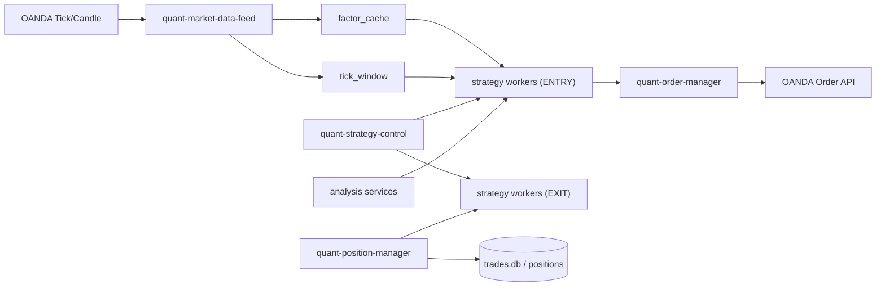

# QuantRabbit — Claude 裁量 FX スキャルピングシステム

USD/JPY 専門の裁量トレーディングシステム。Claude が市況を分析し、自分の判断で OANDA API に直接注文する。ボット/自動売買ではない。

> **運用ミッション**: 口座資金を長期的に最大化する。守りではなく勝ちにいく。

## システム概要

### 現行アーキテクチャ: Claude Code Scheduled Tasks

4つの定期タスクが連携して動く裁量スキャルプシステム:

| タスク | モデル | 間隔 | 役割 |
|--------|--------|------|------|
| **scalp-trader** | Opus | 3分 | 市況分析 → 裁量判断 → OANDA 直接注文 |
| **market-radar** | Sonnet | 2分 | ポジション監視・急変検知・レジーム変化検知 |
| **macro-intel** | Sonnet | 15分 | マクロ分析・戦略改善・ツール開発 |
| **secretary** | Sonnet | 10分 | エージェント監視・状況レポート・異常検知 |

- 排他制御: `scripts/trader_tools/task_lock.py` でファイルロック
- エージェント間連携: `logs/shared_state.json`
- 各タスクのプロンプト: `docs/*_PROMPT.md`
- セットアップ: `bash scripts/trader_tools/setup_scheduled_tasks.sh`

### 絶対ルール

- **ボット禁止**: `while True` + `sleep` の常駐スクリプトを書かない
- **OANDA 直接注文**: urllib で REST API を叩く。ボットプロセス経由禁止
- **裁量トレーダーであれ**: ルール実行マシンではない。市況を読んで自分で判断する
- テクニカル指標は `indicators/factor_cache.py` から取得（手計算しない）
- 注文は必ず `logs/live_trade_log.txt` にファイル記録

## ディレクトリ構成

```
.
├── CLAUDE.md                # Claude エージェントへの指示書（現行システムの定義）
├── AGENTS.md                # ワーカーシステムの仕様（レガシー含む）
│
├── docs/                    # プロンプト、トレードログ、仕様書
│   ├── SCALP_TRADER_PROMPT.md   # scalp-trader タスクのプロンプト
│   ├── MARKET_RADAR_PROMPT.md   # market-radar タスクのプロンプト
│   ├── MACRO_INTEL_PROMPT.md    # macro-intel タスクのプロンプト
│   ├── SECRETARY_PROMPT.md      # secretary タスクのプロンプト
│   ├── CLAUDE_TRADE_LOG.md      # Claude 裁量トレードの記録
│   ├── TRADE_FINDINGS.md        # 改善/敗因の単一台帳（change diary）
│   ├── ARCHITECTURE.md          # システム全体フロー
│   ├── RISK_AND_EXECUTION.md    # リスク制御・発注仕様
│   ├── INDEX.md                 # ドキュメント索引
│   └── ...
│
├── scripts/
│   └── trader_tools/        # Claude 裁量トレード用ツール
│       ├── task_lock.py         # タスク間排他制御
│       └── setup_scheduled_tasks.sh  # スケジュールタスクのセットアップ
│
├── config/
│   └── env.toml             # OANDA API キー等（gitignore 対象）
│
├── indicators/              # テクニカル指標
│   ├── calc_core.py             # ta-lib ラッパ
│   └── factor_cache.py          # 最新指標の共有キャッシュ
│
├── analysis/                # 分析ロジック
│   ├── regime_classifier.py     # Trend / Range / Breakout 判定
│   ├── market_regime.py         # マーケットレジーム
│   ├── market_context.py        # 市況コンテキスト
│   └── ...
│
├── market_data/             # データ取得
│   ├── tick_fetcher.py          # OANDA WebSocket
│   └── candle_fetcher.py        # Tick → Candle 生成
│
├── execution/               # 発注 & リスク
│   ├── order_manager.py         # OANDA REST 発注
│   ├── risk_guard.py            # lot/SL/TP & DD 監視
│   ├── position_manager.py      # ポジション管理
│   └── strategy_entry.py        # 戦略間の意図協調（黒板）
│
├── strategies/              # 戦略プラグイン
│   ├── scalping/                # スキャルピング戦略
│   ├── micro/                   # マイクロ戦略
│   ├── trend/                   # トレンドフォロー
│   ├── breakout/                # ブレイクアウト
│   └── mean_reversion/          # 平均回帰
│
├── workers/                 # ワーカープロセス（レガシー自律ボット系）
│   ├── common/                  # 共通ユーティリティ
│   ├── scalp_*/                 # スキャルプ系ワーカー（約 20 種）
│   ├── micro_*/                 # マイクロ系ワーカー（約 15 種）
│   └── ...                      # 計約 40 ワーカー
│
├── logs/                    # ログ・DB・共有状態
│   ├── shared_state.json        # エージェント間共有状態
│   ├── live_trade_log.txt       # Claude の裁量トレード記録
│   └── trades.db                # トレード履歴 DB
│
└── ops/env/                 # 環境変数プロファイル
    └── local-v2-stack.env       # ローカル V2 スタック設定
```

## ユーザーコマンド

- **「トレード開始」** → マルチエージェント裁量トレードセッション起動
- **「秘書」** → トレーディング秘書モード（状況確認・指示伝達）

## 市場前提（USD/JPY）

- OANDA 平常時スプレッド: 約 0.8 pips
- スプレッド 1.5 pips 以上の急拡大時はクールダウン
- 対象時間帯: 東京〜ロンドン（JST 7-8 時はメンテ除外）

## レガシーシステム（ワーカーベース自律ボット）

本リポジトリには以前の自律ボットトレーディングシステムのコードも含まれている。
現行の Claude 裁量トレードでは `workers/` のコードは参照のみで、ワーカープロセスの起動は行わない。

<details>
<summary>レガシー: ローカル V2 スタック（ワーカーベース）</summary>

### 起動/停止

```bash
# 起動
scripts/local_v2_stack.sh up --profile trade_min --env ops/env/local-v2-stack.env
# 状態確認
scripts/local_v2_stack.sh status --profile trade_min --env ops/env/local-v2-stack.env
# 停止
scripts/local_v2_stack.sh down --profile trade_min --env ops/env/local-v2-stack.env
```

### V2 アーキテクチャ



### 主要サービス

- `quant-market-data-feed` — Tick/Candle 取得、factor_cache 更新
- `quant-strategy-control` — entry/exit/global_lock 制御
- `quant-order-manager` — OANDA REST 発注
- `quant-position-manager` — ポジション管理
- 戦略 ENTRY/EXIT ワーカー対（scalp / micro 系）

### Replay（バックテスト）

```bash
python scripts/replay_exit_workers_groups.py \
  --ticks tmp/ticks_USDJPY_YYYYMM_all.jsonl \
  --workers impulse_break_s5,impulse_momentum_s5 \
  --no-hard-sl \
  --exclude-end-of-replay \
  --out-dir tmp/replay_out
```

詳細は `AGENTS.md` を参照。

</details>

<details>
<summary>レガシー: データ同期・ダッシュボード（GCP/BQ/Looker — 廃止済み）</summary>

以下は過去の GCP 運用の記録。現行ローカル運用では実行しない。

- **BQ 同期**: `scripts/run_sync_pipeline.py` — trades.db → BigQuery
- **Looker Studio**: `scripts/setup_looker_sources.sh` — GCS/BQ 接続
- **オートチューニング UI**: `cloudrun/autotune_ui/` — FastAPI 製承認ダッシュボード
- **GCE SSH**: OS Login / IAP 経由接続

詳細は各スクリプト内のコメントおよび `docs/OPS_GCP_RUNBOOK.md`（履歴アーカイブ）を参照。

</details>

## ドキュメント

| ドキュメント | 内容 |
|---|---|
| `CLAUDE.md` | Claude エージェントへの指示書（現行の定義） |
| `AGENTS.md` | ワーカーシステム仕様・非交渉ルール |
| `docs/INDEX.md` | ドキュメント全体の索引 |
| `docs/ARCHITECTURE.md` | システム全体フロー |
| `docs/RISK_AND_EXECUTION.md` | リスク制御・発注仕様 |
| `docs/TRADE_FINDINGS.md` | 改善/敗因の台帳（change diary） |
| `docs/OBSERVABILITY.md` | ログ・DB スキーマ・SLO |
| `docs/OPS_LOCAL_RUNBOOK.md` | ローカル運用手順 |

## Logs / DB

```bash
# ローカル DB 確認
sqlite3 logs/trades.db "SELECT * FROM trades ORDER BY rowid DESC LIMIT 5"

# ログ確認（レガシーワーカー系）
scripts/local_v2_stack.sh logs
scripts/collect_local_health.sh
```
