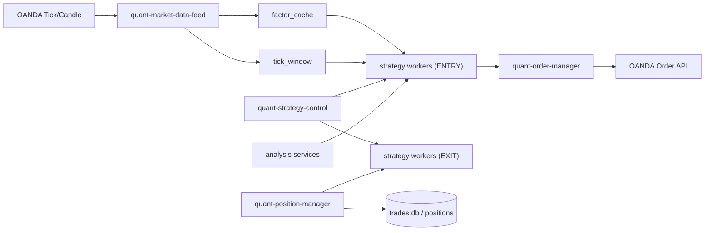

# AGENTS Legacy Workers — ワーカーベース自律ボットの仕様アーカイブ

> **注意**: このファイルはレガシーのワーカーベース自律ボットシステムの仕様記録です。
> 現行の Claude 裁量トレードシステムでは、ワーカープロセスの起動は行いません。
> `workers/` のコードは参照のみです。

---

## ワーカー再編（V2）— 役割を完全分離

### 方針（固定）
- 詳細は `docs/WORKER_ROLE_MATRIX_V2.md`（最上位フロー図・運用制約）を正規版として参照。

- **データ面**: OANDA から tick/足を受けるのは `quant-market-data-feed` のみ。`tick_window` と `factor_cache` を更新することを唯一の責務とする。
- **制御面**: `quant-strategy-control` のみが `entry/exit/global_lock` を持つ。
  各戦略ワーカーは自分の `ENTRY/EXIT` の判定にこれを参照する。
- **戦略面**: 各戦略は必ず `ENTRY ワーカー` と `EXIT ワーカー` を `1:1` で運用。
  `strategy module が複数戦略を内部に持つ` 形は不可。
- 各戦略のENTRY判断は strategy ロジック側で完結。`entry_probability` / `entry_units_intent` を `entry_thesis` へ付与し、`order_manager` はその意図を参照して制約内で実行する。
- **オーダー面**: `execution/order_manager.py` → `quant-order-manager` へ移設済み。
- **ポジ面**: `execution/position_manager.py` → `quant-position-manager` へ移設済み。
- **分析・監視面**: `quant-pattern-book`, `quant-range-metrics`, `quant-dynamic-alloc`, `quant-ops-policy` 等は「データ分析/状態分析」ロールに固定。

### V2 固定サービス群
- `quant-market-data-feed`
- `quant-strategy-control`
- `quant-order-manager`
- `quant-position-manager`
- 戦略 ENTRY/EXIT 一対一サービス（scalp / micro / s5）
- 補助: `quant-pattern-book`, `quant-range-metrics`, `quant-ops-policy`, `quant-dynamic-alloc`, `quant-policy-guard`

### V2 アーキテクチャ

---

## V2 導線フリーズ運用（env/systemd 監査）

- 方針: 発注導線・EXIT導線は V2 分離構成を変えず固定し、後付けの一律判断を導入しない。
- 不変条件
  - エントリーは strategy worker → `execution.order_manager` → 共通 preflight のみ。
  - `order_manager` が戦略の選別ロジックを上書きしない。
  - close/exit 判断は各 strategy の exit_worker と該当ワーカー側ルールを主とする。
  - `entry_probability` と `entry_units_intent` を `entry_thesis` で必須維持。
  - `quantrabbit.service` を本番主導線にしない。
- ローカル監査
  - `scripts/local_v2_stack.sh status --env ops/env/local-v2-stack.env` と `scripts/collect_local_health.sh` で実施。

---

## 型（Pattern Book）運用ルール

- 目的: トレード履歴から「勝てる型 / 避ける型」を継続学習し、エントリー時の `block/reduce/boost` 判断に使う。
- 収集ジョブ: `scripts/pattern_book_worker.py`（`quant-pattern-book.service` + timer、5分周期）
- 主な出力:
  - DB: `logs/patterns.db`
  - JSON: `config/pattern_book.json` / `config/pattern_book_deep.json`
- エントリー連携: `execution/order_manager.py` preflight で `workers/common/pattern_gate.py` を評価
- デフォルトは戦略 opt-in（`ORDER_PATTERN_GATE_GLOBAL_OPT_IN=0`）

---

## ワーカー固有の非交渉ルール

以下はワーカーベースの自律ボット運用時に適用されるルール:

- 現行デフォルト: `WORKER_ONLY_MODE=true` / `MAIN_TRADING_ENABLED=0`
- **後付けの一律EXIT判定は作らない**。exit判断は各戦略ワーカー/専用 `exit_worker` のみ。
- 各戦略は `entry_thesis` に `entry_probability` と `entry_units_intent` を必須で渡す。
- **黒板協調**は `execution/strategy_entry.py` 経由で実装。2秒ウィンドウ内の `entry_intent_board` で照合。
- 発注経路はワーカーが直接 OANDA に送信（`SIGNAL_GATE_ENABLED=0` / `ORDER_FORWARD_TO_SIGNAL_GATE=0`）。
- 共通エントリー/テックゲート（`entry_guard` / `entry_tech`）は廃止・使用禁止。
- Brain ゲート: `workers/common/brain.py` を `execution/order_manager.py` preflight に適用（safe canary: micro-only / apply / fail-open）。

---

## 時限情報（ワーカー運用パラメータ）

> 以下はワーカーベース運用時の個別戦略パラメータ記録。
> 監査根拠は `docs/TRADE_FINDINGS.md` / `docs/RISK_AND_EXECUTION.md` を正とする。

### Brain gate（2026-03-09）
- `LOCAL_V2_EXTRA_ENV_FILES=ops/env/profiles/brain-ollama-safe.env` を既定
- strong setup (`entry_probability>=0.80`, `confidence>=75`) かつ通常 spread/ATR 帯では `BLOCK` → `REDUCE` へ矯正
- `BRAIN_FAILFAST_CONSECUTIVE_FAILURES=2` / `BRAIN_FAILFAST_COOLDOWN_SEC=30` / `BRAIN_FAILFAST_WINDOW_SEC=60`

### watchdog（2026-03-16）
- 既定 profile は `trade_min`
- recovery/status critical path は bash here-doc や `/tmp` 一時ファイルに依存しない

### RangeFader（2026-03-09）
- `RANGEFADER_ENTRY_LEADING_PROFILE_REJECT_BELOW=0.30`
- `RANGEFADER_BASE_UNITS=14000`
- `RANGEFADER_COOLDOWN_SEC=20.0`

### MomentumBurst（2026-03-09）
- `reaccel` を `entry_thesis.reaccel=true` で order/trade 監査へ露出
- micro sizing: `MomentumBurst:1.05`, `MicroLevelReactor:1.35`
- `STRATEGY_COOLDOWN_SEC=120`
- `rsi_take` を薄利帯で通さず `rsi_take_min_pips` を下限
- context tilt: `RANGE_SCORE_SOFT_MAX=0.34`, `CHOP_SCORE_SOFT_MAX=0.58`, `CONTEXT_BLOCK_THRESHOLD=0.92`
- `MOMENTUMBURST_REACCEL_COOLDOWN_SEC=35`

### MicroLevelReactor / MicroTrendRetest（2026-03-10）
- reverse-entry RCA 改善は strategy-local の動的 quality / exit を正とする
- `level_reactor.py`: recent M1 continuation と `ma_gap` 拡大型を reclaim 判定へ織り込み
- `trend_retest.py`: same-direction chase pressure 下の shallow retest を reject

### WickReversalBlend 系（2026-03-11〜12）
- `DroughtRevert` / `PrecisionLowVol` / `VwapRevertS`: worker 内 `flow_guard` を正とする
- `PrecisionLowVol` / `DroughtRevert`: `ORDER_MIN_RR_STRATEGY_*=1.10`
- setup-pressure guard: recent SL burst 中は weak re-entry を reject
- worker-local `flow_guard` を binary に潰して shared setup context を上書きしない
- perf guard: `SCALP_PRECISION_LOWVOL_PERF_GUARD_ENABLED=0` / `SCALP_PRECISION_DROUGHT_REVERT_PERF_GUARD_ENABLED=0`

### scalp_extrema_reversal（2026-03-12）
- short 全停止を正とせず、shallow probe を worker local で落とす
- `ORDER_MANAGER_PRESERVE_INTENT_REJECT_UNDER_STRATEGY_SCALP_EXTREMA_REVERSAL(_LIVE)=0.35`
- `ORDER_MANAGER_PRESERVE_INTENT_MIN/MAX_SCALE=1.00`

### scalp_ping_5s_d（2026-03-11）
- `SCALP_PING_5S_D_TP_ENABLED=1`
- D variant: horizon に逆らい `m1_trend_gate == m1_opposite` の entry を reject

### M1Scalper（2026-03-11）
- `quickshot` / `reversion` / `breakout_retest` / `vshape` を env 固定 gate のまま扱わない
- signal ごとに `flow_regime` / `setup_quality` / `setup_fingerprint` を live factor から算出

### scalp_macd_rsi_div_b（2026-02-19）
- `range-only` + divergence 閾値強化のプロファイル
- 運用値: `ops/env/quant-scalp-macd-rsi-div-b.env`

### Shared participation / feedback（2026-03-11〜12）
- strategy-wide blanket trim を正としない
- setup-scoped override のみ適用
- `setup_min_attempts=4` / fast-profit: `setup_min_attempts=2`
- zero-profit lane を `boost_participation` しない
- stale artifact は runtime no-op
- `STRATEGY_FEEDBACK_LOOP_SEC=120`
- `participation_allocator`: `--lookback-hours 6 --min-attempts 12 --max-units-cut 0.22 --max-units-boost 0.24 --max-probability-boost 0.10`
- runtime cap: `STRATEGY_PARTICIPATION_ALLOC_MULT_MAX=1.24` / `STRATEGY_PARTICIPATION_ALLOC_PROB_BOOST_MAX=0.12`

### dynamic_alloc / auto_canary（2026-03-11）
- strategy-wide blanket trim を正としない
- setup-scoped override のみ
- `setup_min_trades=4`、severe loser は `setup_min_trades` 未満でも override emit
- unknown strategy fallback: `WORKER_DYNAMIC_ALLOC_UNKNOWN_FALLBACK_MAX_AGE_SEC=600`

### market order fill protection（2026-03-12）
- retry / slippage 後の actual `executed_price` に対して broker protection を再アンカー
- thesis `sl_pips / tp_pips` を actual fill 基準へ引き直し

### shared setup identity（2026-03-12）
- common 形式の `setup_fingerprint` (`Strategy|side|flow_regime|microstructure_bucket|...`) を復元の正とする
- `RangeFader` のような custom fingerprint は parser 対象外

### ローカル V2 運用モード（2026-03-04）
- ローカルV2検証導線: `scripts/local_v2_stack.sh` + `ops/env/local-v2-stack.env`
- sidecar ポート: `ops/env/local-v2-sidecar-ports.env`（`18300/18301`）
- `position-manager`: `POSITION_MANAGER_SERVICE_PORT=8301`
