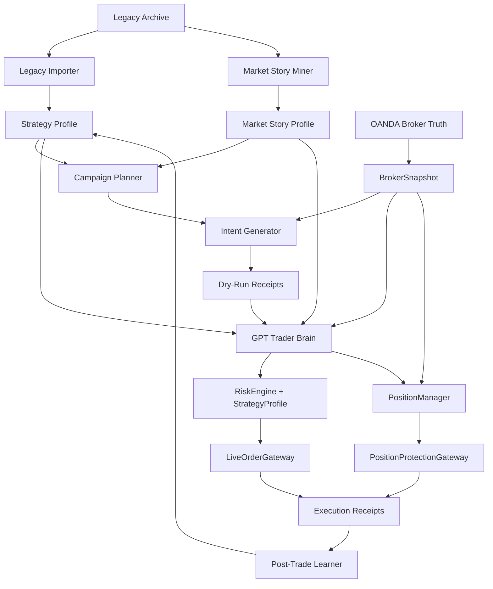

# QuantRabbit Completion Design

## 1. Executive Summary

**Problem Statement**

- QuantRabbit has a tested broker/risk skeleton, but it is not yet a completed autonomous professional trader.
- Current blockers are: live-ready 10% campaign coverage is not yet proven on real current-market receipts, and live certification still requires unattended dry-run artifacts plus an explicit monitored live pilot.

**Proposed Solution**

- Build the system from broker truth outward into a closed-loop autonomous trader: evidence mining -> market state -> campaign planning -> GPT trader reasoning -> deterministic risk validation -> staged/live execution -> protection -> post-trade learning.
- Treat 10% of day-start equity as a mandatory product KPI and completion benchmark; missed targets become structured gap reports and improvement tasks, never risk-gate bypasses.

**Success Criteria**

- Daily campaign creates enough live-ready, risk-valid lanes to plausibly cover `day_start_equity * 10%` before live execution.
- Replay/backtest harness shows target coverage and expectancy across mined legacy days, including losers, missed edges, and intervention-risk sessions.
- GPT trader receipts pass schema, evidence-citation, risk-consistency, and no-hallucinated-order checks.
- `autotrade-cycle --send` can run unattended while never adding unprotected, external/manual, pending-entry, or over-budget exposure, widening SL, moving existing TP, or sending without fresh broker truth.
- `autotrade-cycle` must stop fresh entries once `daily-target-state` reports `TARGET_REACHED_PROTECT`; flat cycles become no-send and protected trader-owned exposure can add only through portfolio risk validation.
- Live/dry-run reports produce daily PnL attribution, target gap explanation, and next-system-improvement task list.

## 2. User Experience & Functionality

**User Personas**

- Operator: starts/stops automation, reviews daily target progress, and confirms environment readiness.
- Autonomous Trader: GPT reasoning layer that chooses trade/wait/protect/close from evidence and current broker truth.
- Risk Officer: deterministic code that can veto any trader decision before broker writes.
- Portfolio Director: campaign layer that allocates daily target pressure across desks and records why a lane wins.

**User Stories**

- As the operator, I want one command to run the full safe loop so that live automation uses the same path every time.
- As the trader, I want archived trade logs and current market context available before deciding so that decisions are evidence-grounded.
- As the risk officer, I want every action validated against fresh broker truth so that stale or duplicated exposure cannot slip through.
- As the portfolio director, I want the 10% target decomposed into lanes, risk budget, and coverage gaps so that the system improves toward completion.
- As the post-trade learner, I want every trade outcome reconciled with its original thesis so that future prompts and profiles improve from receipts.

**Acceptance Criteria**

- `autotrade-cycle --send` is the only live automation entrypoint.
- Every live entry goes `BrokerSnapshot -> IntentGenerator -> GPTTraderBrain -> RiskEngine -> StrategyProfile -> LiveOrderGateway`.
- Every open exposure goes `BrokerSnapshot -> GPTTraderBrain -> PositionManager -> PositionProtectionGateway`.
- Every lane has thesis, method, narrative, chart story, invalidation, TP, SL, units, expected reward, worst-case loss, and campaign role.
- Unprotected, external/manual, over-budget, or pending-entry exposure blocks fresh entries unless the action is protection, cancellation, or close.
- Protected trader-owned exposure may add only through portfolio risk validation and current receipts.
- No-trade decisions are receipts with explicit blockers, not silent failures.

**Non-Goals**

- No guaranteed profit claims.
- No prompt-only trading.
- No direct OANDA helpers outside the two gateways.
- No copied legacy scheduler/order-helper behavior without vNext tests and receipts.
- No strategy promotion from memory alone.

## 3. AI System Requirements

**GPT Trader Role**

- GPT is the discretionary reasoning layer, not the final authority to send orders.
- GPT may choose `TRADE`, `WAIT`, `CANCEL_PENDING`, `PROTECT`, `TIGHTEN_SL`, `CLOSE`, or `REQUEST_EVIDENCE`.
- GPT must compare mined history, current market story, broker exposure, campaign role, risk geometry, and rejected alternatives.
- GPT output must be structured JSON plus a human-readable receipt.

**Required GPT Input Packet**

- Fresh `BrokerSnapshot` summary.
- Top campaign lanes and their dry-run receipts.
- Strategy profile for pair/direction/method.
- Market story profile with regime, narrative, chart story, event risk, and method pressure.
- Current position-management state.
- Daily target state: start equity, target JPY, realized PnL, remaining target, remaining risk budget.
- Legacy analogs: similar wins, similar losses, missed edges, manual interventions, execution failures.

**Required GPT Output Schema**

```json
{
  "action": "TRADE|WAIT|CANCEL_PENDING|PROTECT|TIGHTEN_SL|CLOSE|REQUEST_EVIDENCE",
  "selected_lane_id": "string|null",
  "selected_lane_ids": ["string"],
  "confidence": "LOW|MEDIUM|HIGH",
  "thesis": "string",
  "method": "TREND_CONTINUATION|RANGE_ROTATION|BREAKOUT_FAILURE|EVENT_RISK|POSITION_MANAGEMENT",
  "narrative": "string",
  "chart_story": "string",
  "invalidation": "string",
  "rejected_alternatives": ["string"],
  "risk_notes": ["string"],
  "evidence_refs": ["string"],
  "strategy_reviews": [
    {"lane_id": "string", "method": "string", "verdict": "SUPPORTS|REJECTS|BLOCKED|WATCH", "summary": "string"}
  ],
  "specialist_reviews": [
    {
      "role": "macro_news|indicator|flow_levels|risk_audit|strategy|portfolio_context",
      "lane_id": "string|null",
      "method": "string|null",
      "verdict": "SUPPORTS|REJECTS|BLOCKED|WATCH",
      "summary": "string",
      "cited_evidence_refs": ["string"],
      "hard_gate_codes": ["string"],
      "read_only": true,
      "live_permission": false
    }
  ],
  "operator_summary": "string"
}
```

**AI Evaluation Strategy**

- Schema validity: 100% required.
- Evidence grounding: every trade/protect/close action cites legacy or current evidence refs.
- Risk consistency: GPT cannot propose units, TP, SL, or action that conflicts with deterministic risk metrics.
- Anti-hallucination: GPT cannot invent broker positions, orders, prices, logs, or target progress.
- Decision quality: replay evaluation scores whether GPT improved entry timing, avoided bad legacy trades, found missed edges, and respected no-trade conditions.

## 4. Technical Specifications

**Target Architecture**



**Core Components To Finish**

- `GPTTraderBrain`: implemented initial model wrapper, broker-truth input packet, schema contract, JSON receipt, and report.
- `DecisionVerifier`: implemented initial rejection of unsupported actions, invented evidence refs, unknown/non-live-ready lanes, pending/non-layerable exposure trades, and incomplete trade theses.
- `ReplayBacktester`: implemented archived-day target coverage replay.
- `DailyTargetLedger`: records start equity, realized/unrealized PnL, target, coverage, used risk, and missed-target reason.
- `ExecutionReplayer`: replays live-ready order receipts over supplied quote paths and records fill/TP/SL outcomes without broker writes.
- `PostTradeLearner`: links outcome to original lane/thesis and proposes receipt-backed profile updates without silent mutation.
- `CoverageOptimizer`: identifies why target coverage is missing and proposes lane expansion, timing changes, trigger types, or strategy repairs.
- `DryRunCertifier`: verifies coverage, replay, learning, no-send artifacts, GPT status, and intent contracts before live expansion.

**Integration Points**

- OANDA read/write: existing `OandaExecutionClient`, `LiveOrderGateway`, `PositionProtectionGateway`.
- Legacy evidence: `data/legacy_history.db`, archived logs, journals, handoffs, market-story files.
- Codex GPT receipt: Codex automation writes the discretionary decision JSON; QuantRabbit verifies it with strict schema validation and full prompt/response audit before any gateway call.
- Reports: `docs/*_report.md` plus machine-readable JSON in `data/`.

**Security & Safety**

- Live send requires `QR_LIVE_ENABLED=1`, `--send`, explicit lane id, fresh broker truth, live risk validation, and strategy validation.
- Model output is advisory until `DecisionVerifier`, `RiskEngine`, and the relevant gateway accept it.
- Position-protection actions can only reduce or repair risk.
- Known live-risk failure mode fixed: `stage-live-order` and any direct `RiskEngine` caller must reject fresh entries when exposure is unprotected, external/manual, pending-entry, or over portfolio budget; protected trader-owned exposure can add only inside portfolio risk validation.
- Known campaign failure mode fixed: fixed 1.5R receipt geometry cannot cover a 10% daily target under a 500 JPY per-entry cap, so campaign lanes now carry evidence-backed runner reward/risk targets while preserving the loss cap.
- Known live-risk failure mode fixed: `stage-live-order` must reject saved receipts whose status is not `LIVE_READY`, even when a fresh snapshot would make the raw geometry pass; profile promotion and dry-run receipts cannot be skipped by picking a lane id manually.
- Known live-risk failure mode fixed: pending entries must be on the executable side of the live quote (`BUY STOP` above ask, `SELL STOP` below bid, `BUY LIMIT` below ask, `SELL LIMIT` above bid), and live market receipts with stale expected entry prices must block instead of understating risk.
- Known live-risk failure mode fixed: slow market-story/context refresh must not reuse an old broker snapshot for intent pricing; `autotrade-cycle` refreshes broker truth immediately before `IntentGenerator` so valid range/trend/failure lanes are not lost to blanket `STALE_QUOTE` blockers.
- Known GPT-handoff failure mode fixed: the verifier packet must include the full default intent breadth, otherwise a deterministic range-rotation lane behind trend/failure alternatives can be rejected as an unknown lane even though it is `LIVE_READY`.
- Known live-risk failure mode fixed: invalid pending-entry receipts, such as missing entry prices, must produce a `BLOCKED` gateway receipt instead of raising before the audit trail is written.
- Known multi-reader failure mode fixed: specialist readers may attach processed observations, but verifier rejects any `specialist_reviews` that are not read-only, claim live permission, cite unknown evidence, mismatch lane/method identity, or carry execution-authority fields.
- Known dry-run certification failure mode fixed: execution replay must price `MARKET` fills from the supplied quote path, not from a stale expected `entry` field that could falsely inflate target coverage.
- Known position-protection failure mode fixed: USD-quoted positions with missing SL and missing `USD_JPY` conversion data route to exit review instead of crashing during capped stop repair.
- USD-quoted pair risk must use the snapshot `USD_JPY` conversion quote; missing, stale, or abnormally wide conversion quotes block broker-truth risk validation.
- Intent receipts, daily target risk, position management, coverage optimization, and execution replay must carry or consume broker-truth JPY risk metrics instead of recomputing USD-quoted risk from a static fallback rate.
- OANDA credentials are only accepted from `QR_OANDA_TOKEN`, `QR_OANDA_ACCOUNT_ID`, and `QR_OANDA_BASE_URL`; legacy `OANDA_*` variables are not a vNext live gate.
- Prompt input must never include secrets; OANDA credentials stay in environment variables.

## 5. Completion Roadmap

**Phase 0: Baseline Freeze**

- Run full test suite and save a baseline completion report.
- Record current blockers: live-ready coverage `0`, open exposure monitor-only, deterministic TraderBrain.
- Acceptance: no regression from current 55 passing tests.

**Phase 1: Daily Target Ledger**

- Status: implemented.
- `daily-target-state` records start equity, target JPY, realized PnL, unrealized PnL, remaining target, open risk, and remaining risk budget.
- `plan-campaign` initializes the ledger from `--start-balance`.
- `autotrade-cycle` refreshes the ledger from fresh broker truth when the state file exists.

**Phase 2: Replay/Backtest Harness**

- Status: initial evidence replay implemented.
- `replay-backtest` replays imported legacy days against the 10% target, current loss cap, captured profit, pretrade evidence, and missed-seat evidence.
- It classifies each day as historical target hit, target hit after risk repair, evidence covers target, risk repair required, edge capture gap, or no evidence coverage.
- Remaining work: tick-level execution replay and model-decision replay.

**Phase 3: GPT Trader Brain**

- Status: initial verified GPT decision layer implemented as `gpt-trader-decision`.
- Replace rule-only final selection with a model-backed `GPTTraderBrain` behind deterministic verification.
- Keep current score engine as prefilter and fallback.
- Current behavior: standalone command writes `data/gpt_trader_decision.json` and `docs/gpt_trader_decision_report.md` from a Codex-created `--decision-response`. `autotrade-cycle --use-gpt-trader --gpt-decision-response ...` now runs the same verifier in the flat-account path and hands off only ACCEPTED `TRADE` decisions whose lane also cleared the deterministic TraderBrain prefilter. QuantRabbit does not call an API-key model for live automation.
- Acceptance: GPT decisions are schema-valid, evidence-cited, and rejected when they contradict risk or broker truth.

**Phase 4: Live-Ready Coverage**

- Status: optimizer implemented; production certification still depends on current receipts.
- Convert `RISK_REPAIR_CANDIDATE` and `MINE_MISSED_EDGE` lanes into validated trigger receipts.
- Expand lane generation across timing windows, pending-entry structures, runner/add structures, and lower-risk unit sizing.
- Acceptance: daily campaign has live-ready sequential ladder coverage sufficient to cover the 10% target in dry-run/replay without treating all lanes as simultaneous exposure.

**Phase 5: Execution Quality**

- Status: gateway checks and quote-path replay implemented; live failed-send reconciliation remains pilot-dependent.
- Add spread/session/slippage filters, order aging, cancel/replace policy, and failed-send reconciliation.
- Acceptance: live gateway journals accepted/rejected intents and catches stale quotes, duplicate exposure, bad spread, and order drift.

**Phase 6: Position Intelligence**

- Add GPT-assisted thesis recheck for open positions.
- Add partial close, runner policy, and target-hit stop behavior only if they remain risk-reducing and tested.
- Acceptance: profitable protected positions can be managed toward target without widening SL or moving existing TP.

**Phase 7: Post-Trade Learning**

- Status: receipt-backed learner implemented.
- Link every close/fill/cancel to original lane, decision receipt, and market context.
- Promote lessons only through receipt-backed profile changes.
- Acceptance: wins, losses, missed moves, and manual interventions create structured learning candidates.

**Phase 8: Unattended Dry-Run Certification**

- Status: certification harness implemented; real certification remains blocked until fresh coverage/replay/learning artifacts pass.
- Run scheduled dry-run cycles for multiple sessions.
- Produce daily target reports, no-trade reports, and post-trade learning reports.
- Acceptance: no unsafe send attempts, no missing receipts, no unexplained target misses.

**Phase 9: Live Certification**

- Enable live sends only after replay and unattended dry-run pass thresholds.
- Start with small risk cap and explicit monitoring window.
- Acceptance: live run respects all gates and produces full audit trail.

## Completion Gates

- Gate A: all unit tests pass.
- Gate B: no direct OANDA write path outside approved gateways.
- Gate C: GPT decision verifier rejects malformed, hallucinated, or risk-inconsistent decisions.
- Gate D: replay proves known legacy losses are blocked or resized under policy.
- Gate E: dry-run campaign reaches 10% target coverage with live-ready lanes.
- Gate F: unattended dry-run completes full sessions with complete receipts.
- Gate G: live pilot sends only verified actions and reconciles broker truth after every write.

## Current Completion Estimate

- Broker/risk skeleton: `80%`.
- Legacy evidence mining: `75%`.
- Autonomous GPT trader: `65%`.
- Daily 10% target engine: `55%`.
- Offline certification path: `70%`.
- Overall completion: `68%`.

## Next Implementation Order

1. Run the current-market receipt chain: import/mine/story/campaign/snapshot/intents/promote/coverage/replay/learning/certify.
2. Close any `optimize-coverage` target gaps by adding or repairing concrete lanes.
3. Run unattended dry-run cycles with GPT handoff enabled until certification stays green across sessions.
4. Only then plan a monitored live pilot with small risk cap and explicit stop conditions.
